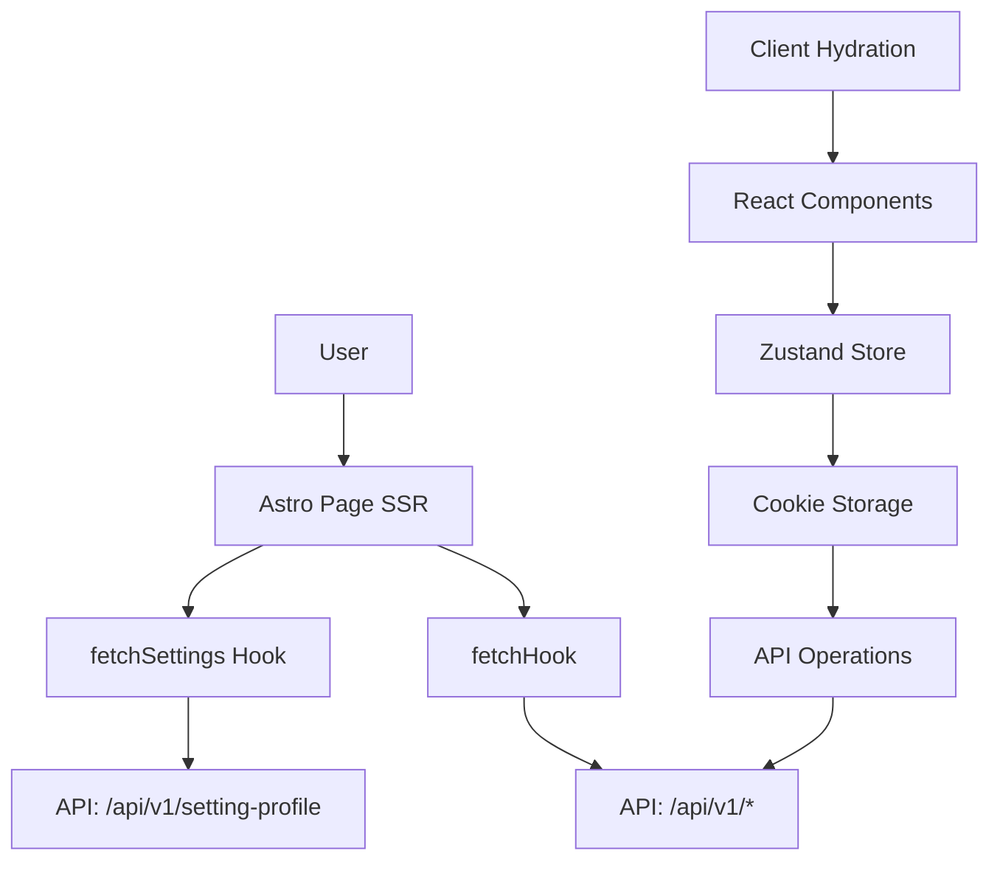

# Project Planning Document: web-small-business-react

## 1. Project Overview

This is a **multi-tenant e-commerce platform** built with Astro and React, designed for small businesses. The application serves as a storefront for businesses to showcase products, manage shopping carts, process orders, and handle customer accounts. It integrates with an external admin API (`admin-emend.cashierthru.com`) for backend operations.

**Project Name:** alelm-v2-website  
**Version:** 0.2.0

---

## 2. Technology Stack

### Core Framework
- **Astro** v4.16.18 - Primary framework with hybrid SSR/SSG rendering
- **React** v19.0.0 - UI components and interactivity
- **TypeScript** v5.9.3 - Type safety

### Rendering Strategy
- **Hybrid Output:** SSG by default, SSR on-demand for dynamic content
- **Adapter:** Node.js standalone adapter
- **Prefetching:** Tap-based strategy for performance

### Key Dependencies
| Category | Libraries |
|----------|-----------|
| UI Components | PrimeReact, PrimeIcons, Lucide React |
| State Management | Zustand |
| Forms | React Hook Form, Zod, @hookform/resolvers |
| Styling | Tailwind CSS, CSS Modules |
| Data Fetching | Axios, React Use (useAsyncRetry) |
| Navigation | Astro routing, React Router (via @/lib/navigation) |
| Animations | Swiper (carousel), NProgress |
| Auth | Firebase Auth |
| Cookies | js-cookie, react-cookie |
| Utilities | clsx, tailwind-merge, html-react-parser |
| SEO | @astrojs/sitemap |
| Analytics | @astrojs/partytown, web-vitals |

---

## 3. Architecture

### Directory Structure
```
src/
├── components/          # React UI components
│   ├── auth/           # Authentication forms (Login, Register, Forgot Password)
│   ├── Cart/           # Shopping cart UI
│   ├── Categories/     # Category navigation and display
│   ├── Checkout/       # Checkout process and address management
│   ├── common/         # Shared components (Image, Link, ErrorBoundary)
│   ├── Hero/           # Homepage banner/hero section
│   ├── OfferProducts/  # Special offers display
│   ├── Orders/         # Order list and detail views
│   ├── Pagination/     # Pagination component
│   ├── Payment/        # Payment processing
│   ├── Product/        # Product display and details
│   ├── Profile/        # User profile management
│   ├── SearchBar/      # Product search
│   └── SelectInput/    # Custom select component
├── hooks/              # Custom React hooks
│   ├── auth/           # Authentication hooks
│   ├── cart/           # Cart management hooks
│   ├── payment/        # Payment processing hooks
│   ├── profile/        # User profile hooks
│   ├── addressHook.tsx # Address management
│   ├── fetch-hook.ts   # Generic API fetcher
│   ├── fetchSettings.tsx # Settings fetching
│   └── order.ts        # Order operations
├── layouts/            # Astro layouts
│   ├── Header/         # Site header with navigation
│   ├── Footer/         # Site footer
│   ├── ColorHandler.tsx # Dynamic theming
│   └── LoginHandler.tsx # Auth state management
├── lib/                # Utility libraries
│   ├── stores/         # Zustand stores
│   ├── global.ts       # Global utilities
│   ├── navigation.ts  # Navigation utilities
│   ├── pricing-utils.ts # Price calculations
│   ├── subdomain.ts   # Multi-tenant subdomain handling
│   └── types.ts       # TypeScript type definitions
├── pages/              # Astro pages (routes)
│   ├── api/            # API endpoints
│   ├── auth/           # Auth pages (login, register, forgot-password)
│   ├── shop/           # Shop pages (cart, checkout, products)
│   ├── user/           # User dashboard
│   └── index.astro     # Homepage
├── providers/          # React context providers
├── services/           # API service layer
└── styles/             # Global CSS
```

### Data Flow


---

## 4. Core Features

### 4.1 Homepage (`/`)
- **Hero Banner:** Swiper-based carousel displaying promotional banners
- **Offer Products:** Special deals section with discounted items
- **Categories:** Category navigation with subcategory support
- **Products Grid:** Paginated product listing with filtering
- **Dynamic Settings:** Shop name, logo, colors loaded from API

### 4.2 Product Catalog
- **Product Listing:** Grid view with pagination
- **Product Detail:** Full product information with:
  - Image gallery
  - Size and color variations
  - Technical specifications
  - Pricing with discounts
  - Add to cart functionality
- **Category Filtering:** Filter by category and subcategory
- **Search:** Product search capability

### 4.3 Shopping Cart (`/shop/cart`)
- **Cart Management:**
  - Add/remove products
  - Update quantities
  - Product variations display
  - Price calculations (subtotal, tax, shipping)
- **Cart Persistence:** Server-side cart via API
- **Empty State:** Friendly empty cart UI

### 4.4 Checkout (`/shop/checkout`)
- **Address Management:**
  - Saved addresses list
  - Add/edit address dialog
  - Shipping fee calculation
- **Order Summary:** Real-time total calculation
- **Order Creation:** Submit order to API
- **Notes:** Additional order notes

### 4.5 User Authentication
- **Login:** Email/password authentication via Firebase
- **Registration:** New user signup
- **Password Reset:** Forgot password flow
- **Session Management:** JWT token storage in cookies

### 4.6 User Dashboard
- **Order History:** List of past orders with status
- **Order Details:** Individual order tracking
- **Profile Management:** Update user information

### 4.7 Settings & Configuration
- **API Endpoint:** `GET /v1/setting-profile`
- **Base URL:** `https://admin-emend.cashierthru.com/api/`
- **Dynamic Theming:** Colors loaded from API (main_color, main_bg, main_font_color)
- **Shop Settings:** Name, logo, about us, contact info, social links (Facebook, Instagram)
- **Tax Configuration:** VAT, tax rate, service charge
- **Cookie Sync:** Settings cached in client-side cookies
- **WhatsApp Integration:** Floating button for customer support
- **Default Images:** Product default image fallback

---

## 5. API Integration

### Base URLs
```env
PUBLIC_API_URL=https://admin-emend.cashierthru.com/api/
PUBLIC_LAST_ROUTE_API_URL=/api/
```

### Key API Endpoints
| Endpoint | Method | Purpose |
|----------|--------|---------|
| `/v1/setting-profile` | GET | Fetch shop settings (name, logo, colors, contact info, tax, VAT, etc.) |
| `/v1/banner` | GET | Fetch homepage banners |
| `/v1/product` | GET | Fetch products (supports filters) |
| `/v1/categories` | GET | Fetch categories |
| `/v1/basket` | GET | Fetch cart items |
| `/v1/basket/add` | POST | Add item to cart |
| `/v1/basket/delete/:id` | DELETE | Remove item from cart |
| `/update-count` | POST | Update cart item quantity |
| `/v1/address` | GET/POST | Address management |
| `/v1/orders` | GET | Fetch user orders |

### Error Handling
- Timeout handling (10-15 second limits)
- HTTP status code checking
- User-friendly error messages
- Redirect to login on 403 errors

---

## 6. Performance Optimizations

### Implemented
- **Image Optimization:** Astro image service with remote pattern support
- **CSS Bundling:** Code splitting with manual chunks for React and UI vendors
- **Prefetching:** Tap-based prefetch for faster navigation
- **HTML Compression:** Enabled
- **Lazy Loading:** Client directives (`client:visible`, `client:idle`)
- **Hybrid Rendering:** Static by default, dynamic on demand

### External Image Domains
- `admin-emend.cashierthru.com`
- `cdn.pixabay.com`
- `i.ibb.co`
- `source.unsplash.com`
- `staging.fawaterk.com`

---

## 7. SEO & Meta

- **Sitemap:** Auto-generated with weekly changefreq
- **Meta Tags:** Dynamic title, description, keywords
- **Structured Data:** Support for rich snippets
- **Robots.txt:** Crawler configuration

---

## 8. Current State Assessment

### Strengths
- Clean component architecture with separation of concerns
- Type-safe with TypeScript
- Responsive design with Tailwind CSS
- Multi-tenant ready (subdomain support)
- Good UX patterns (loading states, error handling)

### Areas for Improvement
- No existing test suite
- Some console.log debugging statements remain
- Could benefit from caching strategies
- No PWA capabilities
- Limited internationalization (Arabic only currently)

---

## 9. Future Roadmap Suggestions

### Phase 1: Stability & Polish
- [ ] Remove debug console.log statements
- [ ] Add error boundaries globally
- [ ] Implement proper loading skeletons
- [ ] Add unit tests for critical hooks

### Phase 2: Performance
- [ ] Implement service worker for offline support
- [ ] Add Redis caching for settings
- [ ] Optimize bundle size further
- [ ] Add image lazy loading with blurhash

### Phase 3: Features
- [ ] Multi-language support (i18n)
- [ ] Customer reviews/ratings
- [ ] Wishlist functionality
- [ ] Advanced product filtering
- [ ] Order tracking with notifications

### Phase 4: Analytics & Monitoring
- [ ] Add error tracking (Sentry)
- [ ] User behavior analytics
- [ ] Performance monitoring
- [ ] A/B testing capabilities

---

## 10. Development Commands

```bash
# Development
npm run dev              # Start dev server on port 3000

# Build
npm run build            # Check types and build for production

# Preview
npm run preview          # Preview production build on port 3000
```

---

*Document generated based on codebase analysis*
*Last updated: February 2026*
